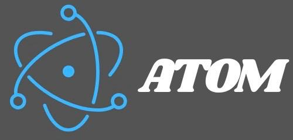

# Atom - Bornes de Commande pour Restaurants Rapides



## 🎯 Description

**Atom** révolutionne la restauration rapide au Sénégal avec des bornes de commande élégantes, ultra-rapides et simples comme un smartphone. Plus de queue, plus d'erreur, paiement en 3 secondes.

## ✨ Fonctionnalités

- 🖥️ Interface utilisateur moderne et intuitive
- 📱 Design responsive adapté aux bornes tactiles
- ⚡ Animations fluides avec Framer Motion
- 🎨 Design premium avec Tailwind CSS
- 🚀 Performance optimale avec Next.js
- 📊 Export statique pour déploiement facile

## 🛠️ Technologies Utilisées

- **Framework**: Next.js 16.0.1
- **UI Library**: React 19.2.0
- **Styling**: Tailwind CSS 4
- **Animations**: Framer Motion 12.23.24
- **Language**: TypeScript 5

## 📦 Installation

```bash
# Cloner le repository
git clone https://github.com/VOTRE_USERNAME/atom-restaurant-kiosk.git

# Naviguer dans le dossier
cd atom-restaurant-kiosk

# Installer les dépendances
npm install
```

## 🚀 Utilisation

### Mode Développement

```bash
npm run dev
```

Ouvrez [http://localhost:3000](http://localhost:3000) dans votre navigateur.

### Build de Production

```bash
npm run build
```

Le site statique sera généré dans le dossier `out/`.

### Lancer en Production

```bash
npm start
```

## 📁 Structure du Projet

```
atom/
├── app/                    # Pages Next.js (App Router)
│   ├── a-propos/          # Page À propos
│   ├── bornes/            # Page Bornes
│   ├── contact/           # Page Contact
│   ├── technologie/       # Page Technologie
│   ├── layout.tsx         # Layout principal
│   └── page.tsx           # Page d'accueil
├── components/            # Composants React réutilisables
│   ├── Avantages.tsx      # Section avantages
│   ├── BornesSection.tsx  # Section bornes
│   ├── ContactForm.tsx    # Formulaire de contact
│   ├── Footer.tsx         # Pied de page
│   ├── Header.tsx         # En-tête
│   ├── Hero.tsx           # Section hero
│   └── ProductCard.tsx    # Carte produit
├── public/                # Assets statiques
│   ├── images/            # Images du projet
│   └── logo.jpg           # Logo Atom
├── styles/                # Styles globaux
└── next.config.ts         # Configuration Next.js
```

## 🌐 Déploiement

### Vercel (Recommandé)

[](https://vercel.com/new/clone?repository-url=https://github.com/VOTRE_USERNAME/atom-restaurant-kiosk)

### Netlify

1. Connectez votre repository GitHub
2. Build command: `npm run build`
3. Publish directory: `out`

### GitHub Pages

1. Activez GitHub Pages dans les paramètres du repository
2. Source: Deploy from a branch
3. Branch: `main`, folder: `/out`

## 🎨 Personnalisation

Les couleurs principales peuvent être modifiées dans `app/globals.css` et les composants individuels.

## 📝 License

Ce projet est sous licence privée.

## 👥 Contact

Pour toute demande de devis ou information, visitez notre [page de contact](https://votre-site.com/contact).

---

**Atom** - La technologie au service de la restauration rapide 🚀
